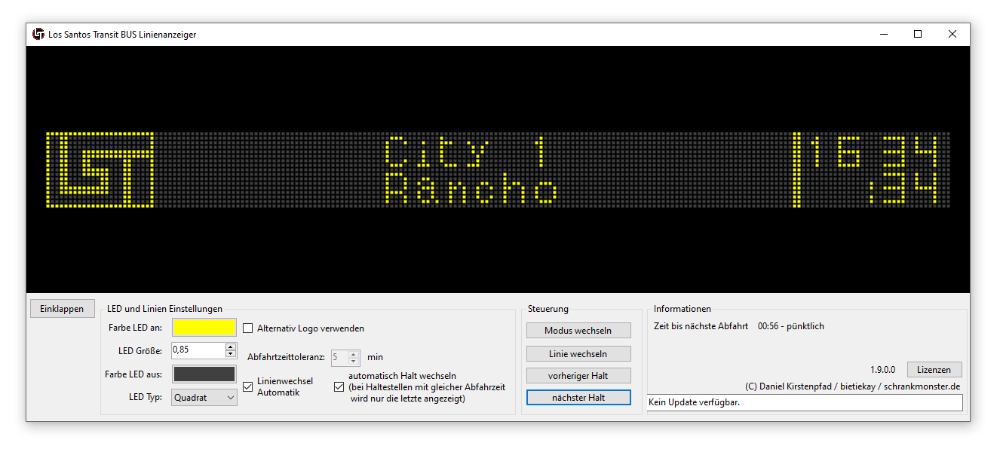

Los Santos Transit - Buslinien Anzeiger für deinen Stream
(c) Daniel Kirstenpfad 2022

## Konfiguration
- du brauchst .NET 6 - https://dotnet.microsoft.com/en-us/download/dotnet/6.0
- Konfiguration Schriftzeichen anpassen in LS-Busline-Font.xml
- Konfiguration Linien und Zeiten anpassen in LST-Busline-Konfiguration.json

## Benutzung
- Starten
- Hotkey-Standardkonfiguration (NICHT NUMPAD!):

| Hotkey   | Funktion        |
|----------|-----------------|
| Ziffer 9 | Nächster Halt   |
| Ziffer 8 | Vorheriger Halt |
| Ziffer 7 | Reset           |
| Ziffer 6 | Linie wechseln  |
| Ziffer 5 | Modus wechseln  |
